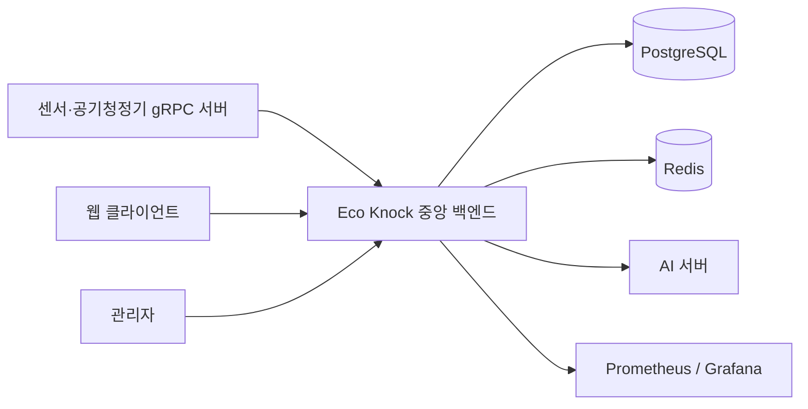
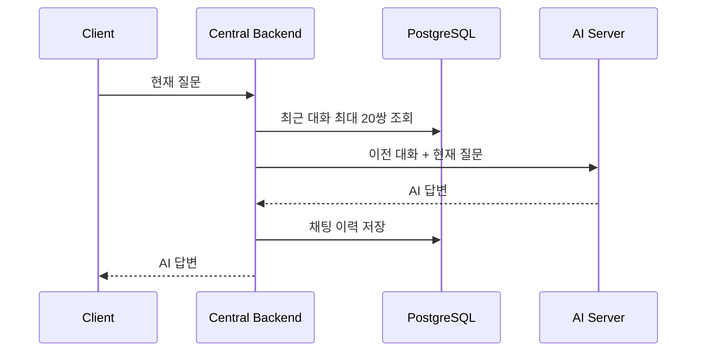
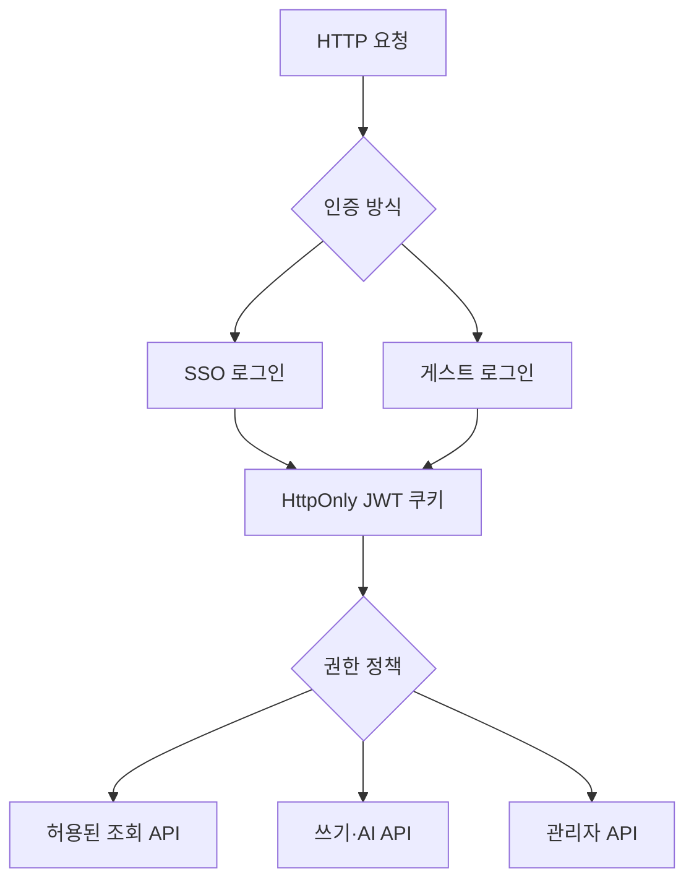
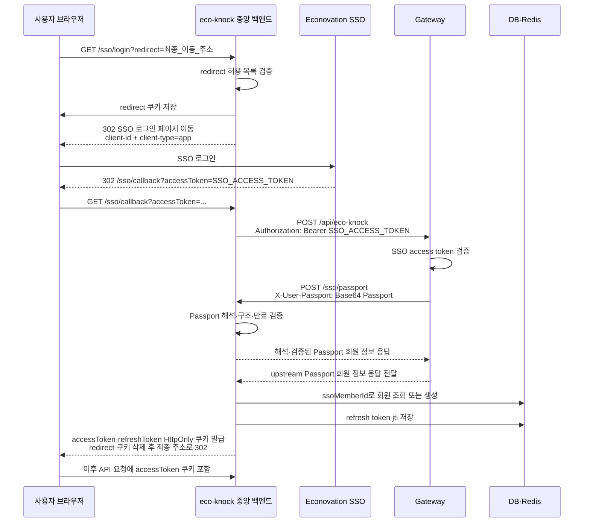

# eco-knock-be-central

`eco-knock-be-central`은 임베디드 장치에서 수집한 센서·조도·공기청정기 gRPC 데이터를 중앙에서 저장하고 조회하는 Spring Boot 백엔드입니다. 공기질 timeseries와 실시간 스트림을 제공하고, 조도와 공기질을 기준으로 공기청정기를 자동 제어합니다.

또한 SSO·게스트 인증, 사용자 바로가기, 텍스트 AI 채팅, 관리자 SSR 화면, OpenAPI 문서 제어, Prometheus/Grafana 모니터링을 제공합니다.

SSO 회원별 서버 관리형 EVM 지갑을 생성하고, 암호화한 개인키와 보상 수령 지갑 주소를 PostgreSQL에서 관리합니다.

## 목차

- [시스템 구성](#시스템-구성)
- [현재 구현 범위](#현재-구현-범위)
- [기술 스택](#기술-스택)
- [프로젝트 구조](#프로젝트-구조)
- [실행 전 요구사항](#실행-전-요구사항)
- [환경 변수](#환경-변수)
- [실행 방법](#실행-방법)
- [proto 생성](#proto-생성)
- [DB 마이그레이션](#db-마이그레이션)
- [주요 데이터 흐름](#주요-데이터-흐름)
- [API 요약](#api-요약)
- [인증과 게스트 정책](#인증과-게스트-정책)
- [관리자 화면](#관리자-화면)
- [API 문서](#api-문서)
- [모니터링](#모니터링)
- [gRPC](#grpc)
- [제한사항](#제한사항)

## 시스템 구성



## 현재 구현 범위

- Spring Boot 4, Java 25, Kotlin 혼합 프로젝트
- PostgreSQL과 Spring Data JPA 기반 데이터 저장
- Flyway 기반 스키마와 materialized view 관리
- Redis 기반 refresh token jti 저장 및 토큰 회전
- 센서·조도 센서·공기청정기 gRPC polling
- queue/consumer 기반 공기질·조도 리포트 저장
- `1m`, `5m`, `15m`, `1h`, `4h`, `1d` 공기질 materialized view와 주기적 refresh
- 공기질 timeseries·history 조회 및 SSE 실시간 스트림
- 조도와 최근 공기질을 기준으로 한 공기청정기 자동제어
- auth-econovation APP SSO 로그인과 HttpOnly JWT 쿠키 인증
- `GUEST` 게스트 로그인과 24시간 하드 만료 세션
- IP별 시간당 5회 게스트 로그인 제한
- 게스트 역할별 API allowlist
- 사용자·게스트 overview shortcut 조회·수정·기본값 재설정 및 grid size 변경
- 텍스트 전용 AI 채팅과 최근 대화 최대 20쌍 전달
- AI 응답의 채팅 이력 및 원본 응답 저장
- 관리자 default shortcut·자동제어 정책·API 문서 공개 상태 관리
- Springdoc OpenAPI와 Scalar API 문서
- Whozin 공개 회원 조회 API 연동
- Actuator, Prometheus, Grafana 성능 모니터링
- Gradle 기반 Protocol Buffers 코드 생성
- SSO 회원별 서버 관리형 EVM 지갑 생성 및 암호화된 개인키 저장
- 신규 회원 지갑 자동 생성과 기존 회원의 누락된 지갑 초기화
- 게스트 회원의 관리형 지갑 생성 제외

## 기술 스택

- Java 25 / Kotlin
- Spring Boot 4 / Spring Security
- Spring Data JPA / PostgreSQL / Flyway
- Spring Data Redis / Redis Lua Script
- Thymeleaf
- Springdoc OpenAPI / Scalar
- gRPC / Protocol Buffers
- Actuator / Micrometer Prometheus
- JJWT
- Web3j
- Gradle

## 프로젝트 구조

```text
src/main/java/jnu/econovation/ecoknockbecentral
├─ ai/model/entity
├─ airquality/model/entity
├─ common
│  ├─ exception
│  ├─ security
│  │  ├─ config
│  │  ├─ dto
│  │  ├─ filter
│  │  ├─ resolver
│  │  └─ util
│  └─ dto/response
├─ control/model
├─ light/model/entity
├─ member/model
├─ wallet
└─ overview/model

src/main/kotlin/jnu/econovation/ecoknockbecentral
├─ ai
│  ├─ client
│  ├─ config
│  ├─ controller
│  ├─ dto
│  ├─ repository
│  └─ service
├─ airquality
│  ├─ controller
│  ├─ dto
│  ├─ messaging
│  ├─ queue
│  ├─ repository
│  ├─ scheduler
│  ├─ service
│  └─ usecase
├─ auth
│  ├─ config
│  ├─ controller
│  ├─ exception
│  ├─ repository
│  ├─ scheduler
│  └─ service
├─ common
│  ├─ extension
│  ├─ metrics
│  └─ openapi
│     ├─ config
│     ├─ constant
│     ├─ controller
│     ├─ dto
│     ├─ repository
│     └─ service
├─ control
├─ grpc
├─ light
├─ member
├─ overview
├─ sso
└─ whozin

src/main/resources
├─ db/migration
├─ redis
├─ static/admin
└─ templates/admin
```

## 실행 전 요구사항

- JDK 25
- Docker와 Docker Compose
- PostgreSQL
- Redis
- 다음 RPC를 제공하는 임베디드 gRPC 서버
  - `sensor.v2.SensorService`
  - `lightsensor.v1.LightSensorService`
  - `airpurifier.v1.AirPurifierService`

기본 설정은 다음과 같습니다.

- 애플리케이션 포트: `18081`
- Actuator 포트: `18082`
- PostgreSQL: `localhost:5432/ecoknock`
- Redis: `localhost:6379`
- 임베디드 gRPC 서버: `localhost:6565`

## 환경 변수

공통 설정은 `src/main/resources/application.yaml`, 환경별 설정은 `application-dev.yaml`과 `application-prod.yaml`에 있습니다. profile을 지정하지 않으면 `dev`가 기본 profile입니다.

개발 환경에서는 루트 `.env` 또는 시스템 환경 변수로 값을 주입할 수 있습니다.

### 필수 환경 변수

| 변수 | 설명 |
| --- | --- |
| `JWT_SECRET_KEY` | JWT HMAC 서명에 사용할 충분히 긴 키 |
| `AES256_KEY` | 정확히 32바이트인 AES-256 키 |
| `WALLET_ENCRYPTION_KEY` | 지갑 개인키 암호화에 사용할 Base64 인코딩된 32바이트 키 |
| `SEPOLIA_RPC_URL` | Ethereum Sepolia 네트워크 조회에 사용할 RPC URL |
| `SEPOLIA_KRT_TOKEN_ADDRESS` | Ethereum Sepolia에 배포된 KRT 컨트랙트 주소 |
| `SSO_CLIENT_ID` | auth-econovation에 등록된 APP client id (`sso.login-page-base-url`은 로그인 화면, `sso.gateway-passport-url`은 Gateway Passport 검증 주소) |
| `WHOZIN_TOKEN` | Whozin 공개 회원 API Bearer token |
| `ADMIN_MASTER_PASSWORD` | 관리자 마스터 비밀번호 및 Grafana 비밀번호 |
| `EMBEDDED_SERVER_HOST` | 임베디드 gRPC 서버 host |
| `EMBEDDED_SERVER_GRPC_PORT` | 임베디드 gRPC 서버 port |
| `AI_SERVER_HOST` | AI 서버 base URL |
| `PROD_THIS_SERVER_URL` | 운영 관리자 origin 허용 목록에 사용할 서버 URL |
| `PROD_GRAFANA_HOST` | 운영 Grafana 외부 HTTPS 주소 |

### 환경별 선택 환경 변수

| 변수 | 기본값 또는 용도 |
| --- | --- |
| `DEV_POSTGRES_HOST` | `localhost` |
| `DEV_POSTGRES_PORT` | `5432` |
| `DEV_POSTGRES_USERNAME` | `postgres` |
| `DEV_POSTGRES_PASSWORD` | 빈 문자열 |
| `DEV_REDIS_HOST` | `localhost` |
| `DEV_REDIS_PORT` | `6379` |
| `DEV_GRAFANA_HOST` | `localhost` |
| `DEV_GRAFANA_PORT` | `3000` |
| `PROD_POSTGRES_HOST` | `postgres` |
| `PROD_POSTGRES_PORT` | `5432` |
| `PROD_POSTGRES_USERNAME` | 운영 PostgreSQL 사용자 |
| `PROD_POSTGRES_PASSWORD` | 운영 PostgreSQL 비밀번호 |
| `PROD_REDIS_HOST` | `redis` |
| `PROD_REDIS_PORT` | `6379` |
| `PROD_SERVER_PORT` | `18081` |
| `PROD_GRAFANA_PORT` | `3000` |

예시:

```dotenv
JWT_SECRET_KEY=replace-with-a-long-secret-key
AES256_KEY=12345678901234567890123456789012
WALLET_ENCRYPTION_KEY=replace-with-base64-encoded-32-byte-key
SEPOLIA_RPC_URL=https://replace-with-ethereum-sepolia-rpc-url
SEPOLIA_KRT_TOKEN_ADDRESS=0xreplace-with-sepolia-krt-token-address
SSO_CLIENT_ID=replace-with-sso-client-id
WHOZIN_TOKEN=replace-with-whozin-token
ADMIN_MASTER_PASSWORD=replace-with-admin-master-password
EMBEDDED_SERVER_HOST=localhost
EMBEDDED_SERVER_GRPC_PORT=6565
AI_SERVER_HOST=http://localhost:8000
PROD_THIS_SERVER_URL=https://replace-with-server.example.com
DEV_POSTGRES_HOST=localhost
DEV_POSTGRES_PORT=5432
DEV_POSTGRES_USERNAME=postgres
DEV_POSTGRES_PASSWORD=postgres
DEV_REDIS_HOST=localhost
DEV_REDIS_PORT=6379
PROD_POSTGRES_USERNAME=postgres
PROD_POSTGRES_PASSWORD=replace-with-prod-password
PROD_GRAFANA_HOST=https://monitoring.replace-with-server.example.com
```

관리자 마스터 로그인은 애플리케이션 시작 시 생성·초기화되는 시스템 회원(`Member.id=0`, `ssoMemberId=0`, `role=ADMIN`)을 사용합니다. 별도 SSO 회원 ID 설정은 필요하지 않습니다.

## 실행 방법

proto 생성은 `compileJava`, `compileKotlin`, `bootRun` 전에 자동으로 연결됩니다.

### 개발 환경

개발 Compose는 PostgreSQL, Redis, Prometheus, Grafana를 실행합니다. Spring Boot 애플리케이션은 IntelliJ 또는 다음 명령으로 호스트에서 실행합니다.

```powershell
.\deploy\dev\dev.ps1
.\gradlew.bat bootRun --args="--spring.profiles.active=dev"
```

Git Bash 또는 Unix 계열 셸:

```bash
sh ./deploy/dev/dev.sh
./gradlew bootRun --args='--spring.profiles.active=dev'
```

Compose 명령은 첫 번째 인자로 전달할 수 있습니다.

```powershell
.\deploy\dev\dev.ps1 ps
.\deploy\dev\dev.ps1 logs
.\deploy\dev\dev.ps1 down
```

### 운영 환경

운영 Compose는 Spring Boot 애플리케이션, PostgreSQL, Redis, Prometheus, Grafana를 함께 실행하고 `prod` profile을 사용합니다.

```powershell
.\deploy\prod\prod.ps1
.\deploy\prod\prod.ps1 logs
.\deploy\prod\prod.ps1 down
```

운영 서버에서 최신 `main`을 받은 뒤 배포 스크립트를 실행하려면 다음을 사용합니다.

```powershell
.\deploy\prod\deploy.ps1
```

```bash
sh ./deploy/prod/deploy.sh
```

배포 스크립트는 저장소를 갱신한 뒤 운영 Compose를 실행합니다. Docker image 빌드 위치와 배포 대상은 실제 운영 인프라의 Compose 실행 환경에 맞춰 관리해야 하며, README는 저장소의 현재 스크립트 동작만 보장합니다.

### 로컬 실행과 테스트

```bash
./gradlew bootRun
./gradlew test
```

Windows PowerShell:

```powershell
.\gradlew.bat bootRun
.\gradlew.bat test
```

테스트도 애플리케이션과 동일한 필수 환경 변수를 사용합니다. Whozin 실제 API 테스트는 `WHOZIN_TOKEN`과 외부 네트워크가 필요합니다.

```bash
./gradlew test --tests "jnu.econovation.ecoknockbecentral.whozin.service.WhozinServiceTest"
```

## proto 생성

수동으로 Protocol Buffers 코드를 생성하려면 다음을 실행합니다.

```bash
./gradlew generateProto
```

생성 대상 proto:

- [`sensor.proto`](./src/main/proto/sensor/v1/sensor.proto)
- [`sensor.v2.proto`](./src/main/proto/sensor/v2/sensor.proto)
- [`lightsensor.proto`](./src/main/proto/lightsensor/v1/lightsensor.proto)
- [`airpurifier.proto`](./src/main/proto/airpurifier/v1/airpurifier.proto)

## DB 마이그레이션

Flyway는 `classpath:db/migration` 아래 SQL을 버전 순서대로 실행합니다.

| 버전 | 내용 |
| --- | --- |
| V1 | `air_quality`, `member` 테이블 생성 |
| V2 | `5m`, `15m`, `1h` 공기질 materialized view 생성 |
| V3 | `1m`, `4h`, `1d` 공기질 materialized view 추가 |
| V4 | materialized view 평균값을 `double precision` 기준으로 재생성 |
| V5 | `light_report` 테이블 생성 |
| V6 | overview shortcut 및 기본 shortcut 테이블 생성 |
| V7 | member SSO 식별자 추가 및 OAuth2 provider 컬럼 제거 |
| V8 | 조도 조회 인덱스와 `control_action_log` 테이블 생성 |
| V9 | 공기청정기 자동제어 정책 테이블 생성 |
| V10 | 자동제어 threshold/ratio 의미에 맞게 컬럼명 변경 |
| V11 | 깨끗한 공기질 비율 threshold 추가 |
| V12 | AI 채팅 이력 테이블 생성 |
| V13 | 사용하지 않는 AI 파일 메타데이터 컬럼 제거 |
| V14 | 게스트 회원 만료 시각과 nullable 회원 필드 지원 |
| V15 | 회원별 관리형 지갑과 암호화된 개인키 저장 테이블 생성 |
| V16 | 회원별 overview 레이아웃과 grid size 저장 테이블 생성 |
| V17 | overview icon URL nullable 처리 및 회원 삭제 cascade 추가 |
| V18 | 회원 삭제 시 `ai_chat_history`도 `ON DELETE CASCADE`로 삭제 |

JPA 설정은 `ddl-auto: validate`이므로 애플리케이션 시작 시 엔티티와 DB 스키마가 일치하는지 검증합니다.

## 주요 데이터 흐름

### 공기질 수집

1. `AirQualityProducer`가 센서·공기청정기 gRPC 서버를 polling합니다.
2. 원시 응답을 `AirQualityDTO`로 병합합니다.
3. `SaveAirQualityQueue`에 저장 명령을 넣습니다.
4. `AirQualityConsumer`가 `air_quality` 테이블에 저장합니다.
5. 저장된 최신 데이터를 SSE 구독자에게 발행합니다.

gRPC 조회에 실패하면 producer는 백오프 delay를 적용합니다.

### 조도 수집과 자동제어

1. `LightProducer`가 조도 센서 gRPC 서버를 polling합니다.
2. `SaveLightReportQueue`에 조도 저장 명령을 넣습니다.
3. `LightConsumer`가 `light_report`에 저장합니다.
4. `AirQualityProducer`가 공기청정기 상태와 공기질 데이터를 조회합니다.
5. `AutoControlAirPurifierConsumer`가 조도·공기질·자동제어 정책을 기준으로 ON/OFF를 판단합니다.
6. 제어 결과를 공기청정기 gRPC RPC로 전달하고 `control_action_log`에 저장합니다.

### AI 채팅



`POST /ai/chat`은 `multipart/form-data`의 `question` 파트만 받습니다. 이전 대화는 오래된 순서로 최대 20쌍을 포함하며, AI 응답을 받은 뒤 채팅 이력을 저장합니다. 이력 저장에 실패해도 이미 받은 AI 답변은 반환합니다.

회원이 삭제되면 `ai_chat_history.member_id` 외래 키의 PostgreSQL `ON DELETE CASCADE`에 따라 해당 회원의 AI 채팅 이력도 함께 삭제됩니다. 애플리케이션 엔티티에 `OneToMany` 컬렉션을 추가하지 않고 Flyway `V18` migration으로 DB에서 처리합니다.

### Overview 바로가기와 레이아웃

`GET /overview/shortcuts`는 인증한 회원 또는 게스트의 `gridSize`와 바로가기 목록을 반환합니다. 바로가기의 `iconUrl`은 선택값이므로 이미지가 없으면 `null`입니다. 게스트도 자신의 바로가기와 레이아웃을 수정하고 기본값으로 초기화할 수 있습니다.

`PUT /overview/shortcuts`는 일반 회원·관리자·게스트의 바로가기 목록을 전체 교체하고, `PUT /overview/shortcuts/reset`은 기본 바로가기로 초기화합니다. `PUT /overview/layout`은 `{"gridSize":2}` 또는 `{"gridSize":3}`으로 자신의 그리드 열 수를 변경합니다. 현재 값과 같은 크기를 요청하면 `409 Conflict`를 반환합니다.

### 회원 관리형 지갑

1. SSO 회원이 처음 저장되면 `MemberCreatedEvent`가 발행됩니다.
2. 회원 저장 트랜잭션이 커밋된 뒤 `MemberCreatedWalletEventListener`가 관리형 지갑 생성을 요청합니다.
3. `MemberWalletService`가 Web3j로 EVM 키 쌍을 생성하고 지갑 주소를 계산합니다.
4. 개인키는 `WALLET_ENCRYPTION_KEY`를 사용하는 AES-256-GCM 방식으로 암호화한 뒤 `member_wallet` 테이블에 저장합니다.
5. 첫 번째 관리형 지갑은 해당 회원의 활성 보상 수령 지갑으로 지정됩니다.
6. 애플리케이션 시작 시 `MemberWalletInitializer`가 지갑이 없는 기존 SSO 회원에게 관리형 지갑을 생성하며, 게스트 회원은 대상에서 제외합니다.

동일 회원의 관리형 지갑 생성은 회원 행에 대한 비관적 쓰기 잠금과 DB unique index로 중복을 방지합니다. 현재 자동 생성과 보상 수령 대상으로 사용하는 지갑 유형은 `MANAGED`이며, 사용자가 직접 등록하는 `EXTERNAL` 지갑 전환 기능은 아직 제공하지 않습니다.

### KRT 온체인 잔액 조회

`GET /wallet/me`는 로그인한 SSO 회원의 활성 보상 지갑을 찾은 뒤, Web3j의 읽기 전용 `eth_call`로 KRT 컨트랙트의 `balanceOf(address)`를 호출합니다. 조회 트랜잭션을 생성하지 않으므로 가스비와 운영 지갑의 개인키가 필요하지 않습니다.

응답에는 `walletAddress`, `walletType`, `balance`, `symbol`이 포함됩니다. KRT의 18 decimals를 적용한 잔액은 JavaScript 숫자 정밀도 손실을 방지하기 위해 문자열로 반환합니다. 게스트 회원은 관리형 지갑을 생성하지 않으므로 이 API의 접근 대상에서 제외됩니다.

## API 요약

상세 요청·응답·오류 형식은 [API 문서](#api-문서)에서 확인합니다.

| 영역 | 메서드 | 경로 | 설명 |
| --- | --- | --- | --- |
| 인증 | `GET` | `/sso/login` | SSO 로그인 시작 |
| 인증 | `GET` | `/sso/callback` | SSO 콜백 처리 |
| 인증 | `POST` | `/auth/guest` | 게스트 회원 생성 및 세션 쿠키 발급 |
| 인증 | `POST` | `/auth/admin` | 관리자 마스터 비밀번호로 ID 0 시스템 관리자 access/refresh 쿠키 발급 |
| 인증 | `POST` | `/auth/reissue` | refresh token으로 access token 재발급 |
| 인증 | `POST` | `/auth/logout` | 현재 refresh 세션 폐기 및 인증 쿠키 삭제 |
| 회원 | `GET` | `/profile` | 현재 로그인 회원(게스트 포함)의 역할·기수·이름·활동 상태 조회. 게스트의 기수·활동 상태는 `null` |
| 공기질 | `GET` | `/air-quality/timeseries` | 공기질 timeseries 조회 |
| 공기질 | `GET` | `/air-quality/timeseries/history` | 공기질 과거 데이터 조회 |
| 공기질 | `GET` | `/air-quality/stream` | 공기질 SSE 스트림 |
| 바로가기 | `GET` | `/overview/shortcuts` | 사용자·게스트 바로가기와 grid size 조회 (`iconUrl`은 null 가능) |
| 바로가기 | `PUT` | `/overview/shortcuts` | 사용자·게스트 바로가기 전체 교체 |
| 바로가기 | `PUT` | `/overview/shortcuts/reset` | 사용자·게스트 기본 바로가기 재설정 |
| 바로가기 | `PUT` | `/overview/layout` | 사용자·게스트 grid size 수정 (동일 값은 `409`) |
| AI | `POST` | `/ai/chat` | 이전 대화와 현재 질문을 이용한 AI 채팅 |
| 지갑 | `GET` | `/wallet/me` | 현재 회원의 활성 보상 지갑 주소와 KRT 온체인 잔액 조회 |
| 관리자 | `GET/PUT` | `/admin/api-docs-access` | API 문서 공개 상태 조회·변경 |
| 관리자 | `GET/PUT` | `/admin/control-settings` | 자동제어 정책 조회·변경 |
| 관리자 | `GET/POST` | `/admin/overview-shortcuts` | 기본 바로가기 조회·저장 |

## 인증과 게스트 정책



### SSO 로그인 전체 흐름

SSO 로그인은 **브라우저가 콜백 URL을 호출하고, 백엔드가 받은 SSO 토큰을 Gateway에서 검증하는 방식**입니다. SSO 토큰 자체를 우리 서비스 API 인증에 계속 사용하지 않고, 검증이 끝난 뒤 우리 백엔드가 발급한 JWT 쿠키로 교체합니다.



#### 단계별로 이해하기

1. 프론트엔드는 백엔드의 `/sso/login?redirect=...`을 호출합니다. `redirect`는 로그인 완료 후 돌아갈 프론트 주소입니다.
2. 백엔드는 redirect 주소가 허용 목록에 있는지 확인한 뒤, 잠시 쿠키에 저장합니다. 허용되지 않은 주소면 SSO 페이지로 보내지 않고 `400`을 반환합니다.
3. 백엔드는 SSO 로그인 화면으로 이동시키면서 `client-type=app`을 사용합니다.
4. 사용자가 SSO에서 로그인하면 SSO 서버가 **사용자의 브라우저**를 백엔드의 `/sso/callback`으로 다시 보냅니다. 따라서 callback은 서버가 서버를 직접 호출하는 것이 아니라 브라우저가 백엔드에 보내는 `GET` 요청입니다.
5. 백엔드는 callback query의 SSO `accessToken`을 Gateway에 `Authorization: Bearer` 헤더로 전달합니다.
6. Gateway는 SSO 토큰을 검증하고, 검증된 회원 정보를 `X-User-Passport` 헤더로 내부 `/sso/passport` upstream에 전달합니다.
7. 백엔드는 Passport에서 회원 정보를 읽어 프로젝트 DB의 `ssoMemberId` 기준으로 회원을 조회하거나 생성합니다. Passport의 `roles`는 프로젝트의 `Member.role`로 변환하지 않습니다.
8. 백엔드는 SSO 토큰이 아닌 프로젝트 자체의 access/refresh JWT를 발급하고 HttpOnly 쿠키로 브라우저에 내려줍니다.
9. 백엔드는 처음 저장해 둔 redirect 쿠키를 삭제하고 프론트를 최종 주소로 `302` 이동시킵니다.
10. 이후 프론트는 `credentials: 'include'`로 요청하고, 브라우저가 프로젝트 JWT 쿠키를 자동으로 전송합니다.

#### Q. 왜 SSO callback을 백엔드에 두나요?
프론트가 SSO access token을 직접 저장하거나 Gateway에 전달하지 않게 하려고입니다.
프론트는 /sso/login?redirect=...으로 브라우저를 이동시키기만 하면 됩니다. 로그인 완료 후 브라우저가 백엔드 callback을 호출하면, 백엔드가 SSO 토큰 검증, 회원 조회·생성, 프로젝트 JWT HttpOnly 쿠키 발급, 최종 redirect까지 처리합니다.
그래서 CSR·관리자 SSR 모두 같은 로그인 흐름을 사용하고, 프론트는 로그인 후 credentials: 'include'로 프로젝트 API만 호출하면 됩니다.

#### 토큰별 역할

| 값 | 발급 주체 | 사용 위치 | 애플리케이션이 별도로 저장하는가? |
| --- | --- | --- | --- |
| SSO `accessToken` | Econovation SSO | callback에서 Gateway 검증 요청 | 저장하지 않음. callback URL에 잠시 포함 |
| `X-User-Passport` | Gateway | `/sso/passport` 내부 upstream 요청 | 저장하지 않음 |
| 프로젝트 `accessToken` | eco-knock 백엔드 | 이후 프로젝트 API 인증 | HttpOnly 쿠키 |
| 프로젝트 `refreshToken` | eco-knock 백엔드 | access token 재발급 | HttpOnly 쿠키 |

- `/sso/passport`는 Gateway upstream 전용 경로입니다. Gateway를 우회한 직접 접근은 네트워크 또는 프록시에서 차단해야 합니다.
- callback URL에는 SSO access token이 잠시 포함되므로 callback 응답은 `Referrer-Policy: no-referrer`를 설정합니다.
- callback의 SSO `refreshToken`과 `accessExpiredTime`은 사용하거나 저장하지 않습니다.
- SSO 인증이 실패하거나 Passport가 만료·손상되면 내부 access/refresh 쿠키를 발급하지 않고 오류를 반환합니다.

- 일반 사용자와 관리자는 access/refresh JWT를 HttpOnly 쿠키로 사용합니다.
- `GET /profile`은 access token으로 인증한 게스트·일반 회원·관리자의 `role`, `cohort`, `name`, `activeStatus`를 반환합니다. 게스트의 `cohort`와 `activeStatus`는 `null`입니다.
- Passport 연동은 [JNU-econovation/auth-common](https://github.com/JNU-econovation/auth-common)을 참고했지만, 현재 프로젝트의 Spring Boot 4와 호환되지 않아 필요한 코드를 프로젝트 내부에 직접 이식해 사용합니다. 따라서 해당 외부 라이브러리는 활성 의존성으로 사용하지 않습니다.
- Passport의 `roles`는 프로젝트의 `Member.role`로 변환하지 않으며, 관리자 접근 여부는 프로젝트 DB의 `Member.role`로 판단합니다.
- CSR 관리자는 `POST /auth/admin`에 JSON 본문 `{"password":"..."}`을 보내 시스템 관리자 회원의 access/refresh HttpOnly 쿠키를 발급받을 수 있습니다. 이후 `credentials: 'include'`로 관리자 JSON API와 회원 정보 API를 호출할 수 있습니다.
- `POST /auth/logout`은 인증 없이 호출할 수 있으며 access/refresh 쿠키를 삭제합니다. 유효한 refresh token의 jti가 Redis에 저장된 현재 세션과 일치할 때만 해당 세션도 폐기하므로, 오래된 token으로 최신 세션을 종료하지 않습니다.
- 게스트는 `POST /auth/guest`로 `GUEST` 회원과 session cookie를 발급받습니다.
- 게스트 세션은 최초 발급 시각부터 최대 24시간만 유효합니다. 재발급해도 만료 시각은 연장되지 않습니다.
- 게스트 로그인은 IP별 시간당 5회로 제한되며 Redis Lua script로 횟수를 원자적으로 증가시킵니다.
- 게스트는 `GET /profile`, `GET /overview/shortcuts`로 자신의 정보를 조회하고, `PUT /overview/shortcuts`, `PUT /overview/shortcuts/reset`, `PUT /overview/layout`으로 자신의 overview를 수정·초기화할 수 있습니다.
- 공기질 조회 API와 SSE 스트림은 별도 공개 API입니다.
- 게스트는 `/ai/chat`, `/wallet/me`, 관리자 API 등 overview 외의 회원 전용·관리자 기능에는 접근할 수 없습니다.
- 게스트 회원은 관리형 지갑을 생성하지 않습니다.
- 만료된 게스트 회원은 5분 주기로 정리되며, 만료된 회원의 토큰은 인증에 사용할 수 없습니다. 회원 삭제 시 wallet·overview 데이터와 AI 채팅 이력이 DB cascade 정책에 따라 함께 삭제됩니다.

## 관리자 화면

관리자 화면은 별도 프론트엔드 앱 없이 Spring Boot와 Thymeleaf로 렌더링합니다.

- default overview shortcut 목록 조회·저장
- API 문서 공개 상태 조회·변경
- 자동제어 정책 조회·수정
- 자동제어 활성화 상태 변경
- SSO 로그인 또는 `ADMIN_MASTER_PASSWORD` 기반 관리자 로그인(SSR 폼: `POST /admin/login/master`, CSR JSON: `POST /auth/admin`)

SSO 로그인 후 관리자 접근 여부는 SSO role이 아니라 프로젝트 DB의 `Member.role = ADMIN`으로 판단합니다. 마스터 비밀번호 로그인은 애플리케이션 시작 시 초기화되는 ID 0 시스템 관리자 회원을 사용합니다.

## API 문서

- Scalar UI: [https://eco-knock.isek-ai.org/scalar](https://eco-knock.isek-ai.org/scalar)
- OpenAPI JSON: `/v3/api-docs`
- OpenAPI YAML: `/v3/api-docs.yaml`

API 문서 경로는 `ApiDocAccessFilter`가 Redis 값으로 공개 여부를 제어합니다.

```text
key   = admin:api-docs:enabled
value = true | false
```

값이 `true`일 때만 문서가 노출됩니다. key가 없거나 Redis 조회에 실패하면 문서 경로는 `404`입니다. 관리자 화면에서 공개 상태를 변경할 수 있습니다.

## 모니터링

Actuator는 management 포트 `18082`에서 health, info, prometheus 지표를 제공합니다.

- dev Prometheus: 호스트에서 실행 중인 앱의 `host.docker.internal:18082/actuator/prometheus` scrape
- prod Prometheus: Compose 내부 `app:18082/actuator/prometheus` scrape
- scrape 주기: 15초
- Prometheus UI: host에 직접 공개하지 않음
- Grafana dev: `http://localhost:${DEV_GRAFANA_PORT:-3000}`
- Grafana prod: `PROD_GRAFANA_HOST`
- Grafana 계정: `admin` / `ADMIN_MASTER_PASSWORD`

Grafana는 datasource와 `Eco Knock Performance` dashboard를 자동 provisioning합니다. 대시보드에는 HTTP 요청·p95·5xx, JVM/CPU/heap, Hikari connection, gRPC, polling·queue, 자동제어, materialized view refresh 지표가 포함됩니다.

## gRPC

현재 사용하는 RPC:

- `sensor.v2.SensorService/GetCurrentSensor`
- `lightsensor.v1.LightSensorService/GetCurrentLightSensor`
- `airpurifier.v1.AirPurifierService/GetCurrentAirPurifier`
- `airpurifier.v1.AirPurifierService/SetAirPurifierPower`
- `airpurifier.v1.AirPurifierService/SetAirPurifierMode`
- `airpurifier.v1.AirPurifierService/SetAirPurifierFavoriteLevel`

센서 RPC 응답에는 기본 측정값 외에도 다음 계산 지표가 포함됩니다.

- `static_iaq`
- `estimated_eco2_ppm`
- `estimated_bvoc_ppm`
- `accuracy`
- `stabilization_progress_pct`
- `gas_percentage`
- `learning_complete_at_unix_ms`

## Redis Script

Redis script는 `src/main/resources/redis`에 둡니다.

- [`rotate-refresh-token.lua`](./src/main/resources/redis/rotate-refresh-token.lua): refresh token jti 비교와 새 jti 저장을 원자적으로 수행
- [`delete-refresh-token-if-matches.lua`](./src/main/resources/redis/delete-refresh-token-if-matches.lua): refresh token jti가 현재 저장값과 일치할 때만 세션을 원자적으로 삭제
- [`increment-guest-login-rate-limit.lua`](./src/main/resources/redis/increment-guest-login-rate-limit.lua): IP별 게스트 로그인 횟수 증가와 TTL 설정을 원자적으로 수행

## 제한사항

- 임베디드 gRPC 서버가 실행되지 않으면 공기질·조도 producer가 연결 실패 로그를 남기고 백오프합니다.
- SSO 로그인은 auth-econovation 서버와 외부 네트워크에 의존합니다.
- Whozin 실제 API 조회는 `WHOZIN_TOKEN`과 외부 네트워크에 의존합니다.
- AI 채팅은 `AI_SERVER_HOST`로 설정한 외부 AI 서버에 의존합니다.
- 게스트 데이터는 SSO 회원으로 승계되지 않습니다.
- 게스트는 AI 기능과 쓰기·관리자 API를 사용할 수 없습니다.
- API 문서는 Redis 공개 토글이 활성화된 경우에만 확인할 수 있습니다.
- 관리형 지갑 개인키 복호화에는 생성 당시 사용한 `WALLET_ENCRYPTION_KEY`가 계속 필요합니다.
- KRT 잔액 조회는 `SEPOLIA_RPC_URL`로 설정한 Ethereum Sepolia RPC 제공자에 의존합니다.
- 사용자가 직접 등록하는 외부 EVM 지갑 전환 기능은 아직 구현되지 않았습니다.
